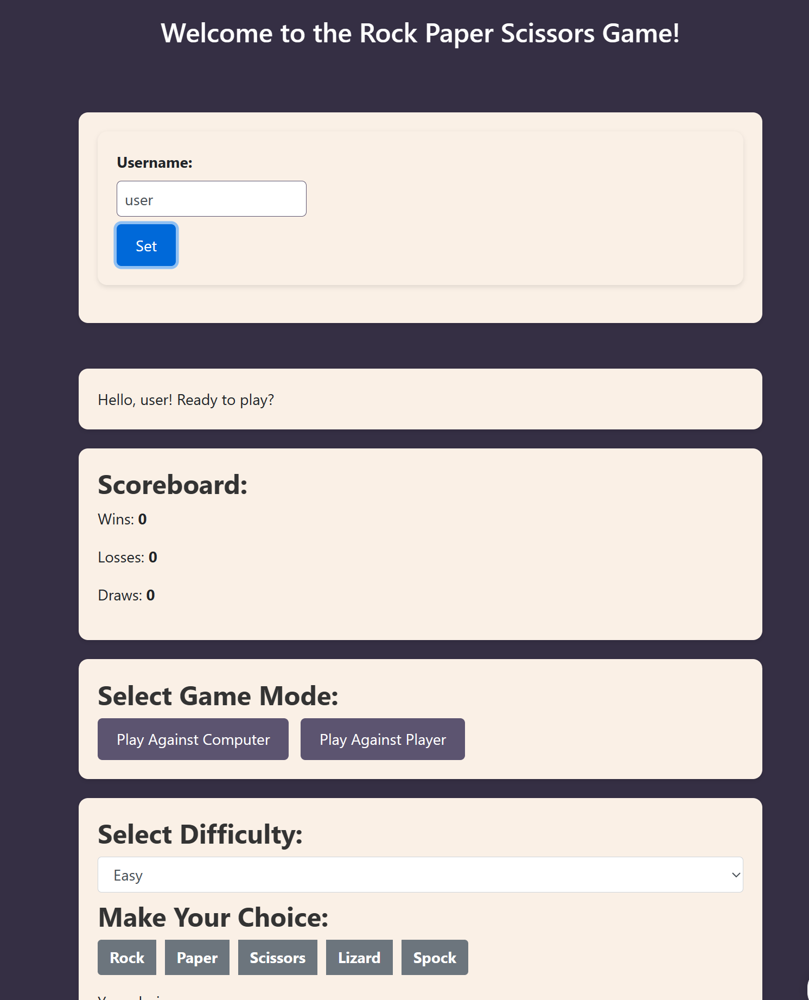

# Rock Paper Scissors Multiplayer Game 🪨📃✂️🖖🦎

A real-time multiplayer Rock Paper Scissors game built using Socket.io and Express.



## Table of Contents

- [Rock Paper Scissors Multiplayer Game 🪨📃✂️🖖🦎](#rock-paper-scissors-multiplayer-game-️)
  - [Table of Contents](#table-of-contents)
  - [Introduction](#introduction)
  - [Features](#features)
  - [Installation](#installation)
  - [Usage](#usage)
  - [Technologies Used](#technologies-used)
  - [Tests](#tests)
    - [Running Tests](#running-tests)

## Introduction

The **Rock Paper Scissors Multiplayer Game** is a fun and interactive project that allows players to compete against each other in the classic Rock Paper Scissors game. The game uses Socket.io for real-time communication, providing players with a seamless gaming experience.

## Features

- Play against the computer or challenge another player.
- Real-time gameplay using Socket.io.
- Select difficulty levels when playing against the computer.
- Responsive design for a great user experience on all devices.


## Installation

1. Clone the repository to your local machine:

   ```bash
   git clone https://github.com/ace18zz/rock-paper-scissors-multiplayer.git
   cd rock-paper-scissors-challenge
   ```

2. Install the required dependencies:

   ```bash
   npm install
   ```

3. Start the server:

   ```bash
   node server.js
   ```

4. Open your web browser and visit `http://localhost:3001` to play the game.

## Usage

1. Launch the game and enter your username.
2. Choose a game mode:
   - **Play Against Computer:** Select the difficulty level and make your move.
   - **Play Against Player:** Challenge another player and make your move.
3. View the game results and score on the scoreboard.

## Technologies Used

- **Node.js:** Server-side JavaScript runtime.
- **Express:** Web framework for building the server.
- **Socket.io:** Library for real-time, bidirectional communication.
- **Bootstrap:** CSS framework for responsive design.
- **jQuery:** JavaScript library for DOM manipulation and interaction.

## Tests

Before you can run the tests, ensure that you have `jest` installed. If not, you can add it to your project by running:

```bash
npm install --save-dev jest
```

### Running Tests

1. To run all tests in the project, use the following command:

   ```bash
   npm test
   ```

2. The test results will be displayed on your terminal. It will indicate which tests passed and which ones failed.


